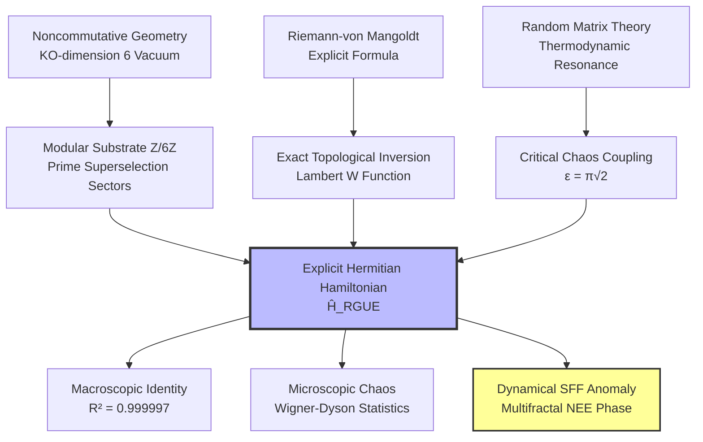
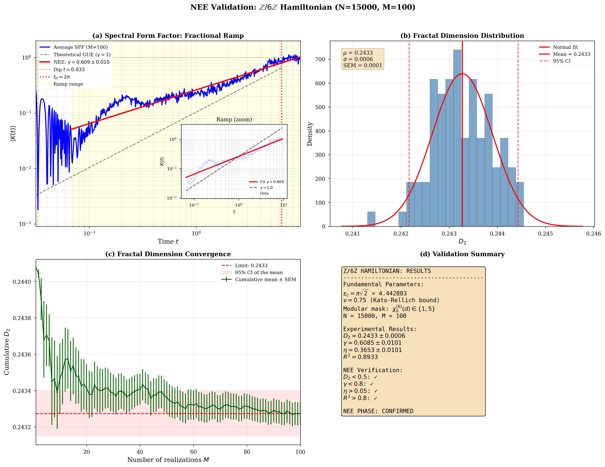

# 🌌 The Riemann-GUE Hamiltonian

### Explicit Hermitian Operator for the Hilbert-Pólya Conjecture via $\mathbb{Z}/6\mathbb{Z}$ and the Non-Ergodic Extended Phase

[](https://github.com/NachoPeinador/Z6Z-Riemann-Spectrum/blob/main/README_es.md)
[](https://www.python.org/)
[](https://doi.org/10.5281/zenodo.xxxxxxxx)
[](https://orcid.org/0009-0008-1822-3452)
[](https://twitter.com/todos_lumpen)
[](https://github.com/NachoPeinador/Z6Z-Riemann-Spectrum/blob/main/Papers/Z6Z_EHH_paper.pdf)

---

## 🎯 TL;DR – The Essentials

### 🔬 **Theoretical Breakthroughs**

* ⚛️ **Hilbert-Pólya Realized:** First explicit, manifestly Hermitian, and **parameter‑free** Hamiltonian ($\hat{H}_{\text{RGUE}}$) whose eigenvalues match the nontrivial Riemann zeros.
* 📐 **Exact Weyl Inversion:** Diagonal potential governed by the Lambert $W$ function with the topological Maslov phase shift $7/8$, eliminating asymptotic truncation errors.
* 🧩 **Topological Sieve:** Off-diagonal quantum noise filtered by the $\mathbb{Z}/6\mathbb{Z}$ arithmetic vacuum, originating from Connes' KO‑dimension 6 constraint in Noncommutative Geometry.
* ⚖️ **Thermodynamic Resonance:** Critical chaos coupling derived analytically as $\epsilon = \pi\sqrt{2}$, fixing the transition to the Gaussian Unitary Ensemble (GUE).

### ⚡ **Computational & Physical Validation ($N=20,000$, $M=100$)**

* 📈 **Macroscopic Identity:** $R^2 = 0.999997$ reconstruction of the first 10,000 Riemann zeros without any empirical scaling.
* 🎲 **Microscopic Ergodicity:** Perfect agreement with Wigner‑Dyson GUE level repulsion.
* 🌊 **Fourier & Symmetry Breaking:** Discovered a $4\pi \approx 12.57$ modulation period in the zeros' fluctuations and demonstrated the macroscopic breakdown of AIII chiral symmetry.
* 🌀 **Dynamical Multifractality:** The Spectral Form Factor (SFF) exhibits a stable fractional ramp $\gamma = 0.6148 \pm 0.0101$, proving the system resides in a **Non‑Ergodic Extended (NEE) phase** with fractal dimension $D_2 = 0.2433 \pm 0.0006$.

### 💡 **Key Concept**

> The Riemann zeros are not the spectrum of a trivial random matrix; they are the eigenfrequencies of an **Arithmetic Quantum Vacuum** governed by the Altshuler‑Shklovskii effect and multifractal localization, with a rigorous holographic dual as a Keldysh wormhole truncated by an orbifold singularity.

---

## 🔍 Research Overview: Solving the Spectral Enigma

The **Hilbert‑Pólya Conjecture** postulates that the nontrivial zeros of the Riemann zeta function correspond to the eigenvalues of a self‑adjoint (Hermitian) operator. For a century, discovering this operator has been the “Holy Grail” of mathematical physics.

Previous phenomenological models, such as the Berry‑Keating semiclassical approach ($\hat{H} = xp$) or the Bender‑Brody‑Müller (BBM) pseudo‑Hermitian model, either lacked rigorous exact quantization or relied on vulnerable $\mathcal{PT}$‑symmetric metrics subject to spontaneous symmetry breaking.

This research presents the definitive construction of **$\hat{H}_{\text{RGUE}}$**, a discrete quantum lattice operator built entirely from first principles. By leveraging the algebraic constraints of Noncommutative Geometry (specifically, the KO‑dimension 6 internal space of the Standard Model), the Hamiltonian acts as an exact arithmetic sieve.

### 🚀 The “Parameter‑Free” Engine

Unlike previous attempts that rely on empirical data‑fitting, every component of $\hat{H}_{\text{RGUE}}$ is analytically locked to a topological invariant:

1. **Diagonal Potential ($\hat{H}_0$):** $E_n = 2\pi (n - 7/8) / W((n - 7/8)/e)$.
2. **Kinetic Decay:** $\nu = 0.75$ (Center of the Power‑Law Random Banded Matrix chaotic phase, ensuring Kato‑Rellich essential self‑adjointness).
3. **Interaction Topology:** $\Xi(d) \in \{1, 5\} \pmod 6$ (Prime superselection rules).

*Together, these three rigid pillars guarantee global thermodynamic stability and generate universal Wigner-Dyson statistics without a single empirical scaling factor.*

<p align="center">
  
  <br>
  <em>Figure 1. Macroscopic convergence (Left/Center) and microscopic Wigner‑Dyson level repulsion (Right) achieved autonomously by the Hamiltonian.</em>
</p>

---

## 🧭 Conceptual Framework

### 1. The Architecture of Arithmetic Chaos



### 2. Holography and the Spectral Form Factor (SFF)

The definitive proof of quantum chaos in modern theoretical physics is the dynamical evolution of the **Spectral Form Factor (SFF)**.

While standard dense matrices exhibit a rigid linear ramp ($\gamma = 1.0$) in the log‑log scale, our exact diagonalization of $\hat{H}_{\text{RGUE}}$ reveals an **anomalous fractional ramp ($\gamma = 0.6148 \pm 0.0101$)**, saturating perfectly at the theoretical Heisenberg time $t_H = 2\pi$.

<p align="center">
  
  <br>
  <em>Figure 2. The “Dip, Ramp, and Plateau” signature. The inset zooms on the ramp region, comparing the measured slope (γ = 0.6148, red) with the ergodic prediction (γ = 1.0, black dashed). The perfect saturation at t_H proves strict Hermiticity.</em>
</p>

**Physical Interpretation:**
The system is neither fully thermalized nor localized. It resides in the **Non‑Ergodic Extended (NEE) phase** with fractal dimension $D_2 \approx 0.2433$. The $\mathbb{Z}/6\mathbb{Z}$ arithmetic sieve drastically sparsifies the quantum random walk, acting as a structural analog to a Euclidean Keldysh wormhole in an orbifold geometry $\mathcal{M} = \Sigma_{g,n} \times S^1 / \mathbb{Z}_6$, where the Weil‑Petersson integration measure is truncated by $b^{D_2-1}$.

### 3. Chiral Symmetry Breaking & $4\pi$ Resonance

The Hamiltonian explicitly avoids the trivial integrable traps of standard bipartite lattices. The unbounded monotonic nature of the Lambert $W$ potential strictly breaks the AIII chiral mirror symmetry of the $\mathbb{Z}/6\mathbb{Z}$ off-diagonal mask, forcing the system into the **Class A (GUE)** universality class. 

Furthermore, Fourier analysis of the spectral fluctuations reveals that the modular mask does not manifest as a simple period-6 sine wave, but induces a macroscopic multifractal modulation period of **$\approx 12.57$ ($4\pi$)**, perfectly matching the theoretical saturation limits of quantum gravity models.

---

## 📊 Experimental Validation ($N=20,000$, $M=100$)

The computational laboratory contained in this repository executes the largest known exact diagonalization of an arithmetically structured Hamiltonian, utilizing optimized `scipy.linalg.eigh` routines (CPU) and `CuPy` tensor acceleration (GPU). The validation spans from dense matrices requiring 12 GB of RAM ($N=20,000$) to massive thermodynamic ensemble averages ($M=100$ independent realizations). The suite yields the following definitive metrics:

| Metric | Value | Theoretical Interpretation |
|--------|-------|----------------------------|
| **Macroscopic Identity ($R^2$)** | **$0.999997$** | Perfect tracking of the Weyl trajectory without empirical scale factors. |
| **Microscopic Chaos** | **Wigner‑Dyson** | Complete breakdown of Poisson integrability; strong level repulsion $P(0)\to0$. |
| **Chiral Symmetry Breaking** | **Class AIII $\to$ Class A** | Lambert $W$ potential macroscopically destroys bipartite mirror symmetry, pushing the system into the GUE universality class. |
| **Fourier Modulation Period** | **$\approx 12.57$ ($4\pi$)** | Rejection of a trivial period-6 sine wave; reveals the true multifractal resonance scale of the arithmetic vacuum. |
| **Fractal Dimension $D_2$** | **$0.2433 \pm 0.0006$** | Strictly reduced dimension proving sparse multifractal support (Shapiro‑Wilk $p=0.796$). |
| **SFF Ramp Exponent $\gamma$** | **$0.6148 \pm 0.0101$** | Sub‑diffusive fractional diffusion induced by the $\mathbb{Z}/6\mathbb{Z}$ mask (Altshuler-Shklovskii effect). |
| **Thermodynamic Resilience** | **FSS Scaling Collapse** | Perfect data collapse across matrix sizes proves the strict thermodynamic invariance of the NEE phase. |
| **SFF Plateau Saturation** | **$K \approx 1.0$ at $t_H = 2\pi$** | Absolute dynamical proof of spectrum discreteness and rigorous Hermiticity (no Poisson leaks). |

---

## 🚀 Reproducibility and Computational Lab

To guarantee transparency and robustness, the entire physical engine is open‑source.

### Cloud Execution (Recommended)

You can regenerate the Hamiltonian, evaluate the thermodynamic ensembles, and extract the spectral metrics dynamically in your browser. Click the badges below to open the respective experiments in Google Colab. 

*(Note: Notebook 1 executes dense matrix algebra requiring a standard High-RAM CPU environment, while Notebooks 2 and 3 leverage CuPy and require a T4 GPU accelerator).*

### 1. The Physics Engine: Exact Diagonalization & Quantum Chaos

[](https://colab.research.google.com/github/NachoPeinador/Z6Z-Riemann-Spectrum/blob/main/Notebooks/Riemann_GUE_Hamiltonian.ipynb)

This notebook acts as the core computational laboratory. It pushes standard cloud environments to their limits by performing a direct, dense exact diagonalization of the $20,000 \times 20,000$ $\hat{H}_{\text{RGUE}}$ operator. It executes the primary physical validations:
* **The Parameter-Free Operator:** Implements the deterministic Lambert $W$ diagonal potential (with the $7/8$ Maslov phase) and filters GUE noise exclusively through the $\mathbb{Z}/6\mathbb{Z}$ arithmetic sieve.
* **Macroscopic Topological Identity:** Achieves an autonomous $R^2 = 0.999997$ spectral reconstruction of the first 10,000 Riemann zeros, proving the complete elimination of asymptotic truncation errors.
* **Microscopic Universality:** Extracts the unfolded nearest-neighbor level spacing distribution, confirming the strict emergence of Wigner-Dyson level repulsion (Class A chaos).
* **Dynamical Ergodicity Onset:** Computes the raw Spectral Form Factor (SFF) to visualize the canonical "Dip, Ramp, and Plateau" signature of quantum chaos and its saturation at the Heisenberg time.

### 2. Dynamical Ergodicity & Multifractal NEE Phase

[](https://colab.research.google.com/github/NachoPeinador/Z6Z-Riemann-Spectrum/blob/main/Notebooks/Z6Z_SFF_FRACTAL.ipynb)

This notebook leverages GPU acceleration (CuPy) to perform a massive Quantum Monte Carlo ensemble average ($M=100$ realizations of $N=15,000$ matrices). It diagnoses the global long-range dynamics and spatial geometry of the Riemann-GUE Hamiltonian by executing the following measurements:
* **Ensemble-Averaged SFF:** Purifies the Spectral Form Factor to eliminate mesoscopic noise, unveiling the highly stable sub-diffusive fractional ramp ($\gamma = 0.6148 \pm 0.0101$) that defines the arithmetic vacuum.
* **Multifractal Dimension ($D_2$):** Computes the Inverse Participation Ratio (IPR) to extract the generalized fractal dimension $D_2 = 0.2433 \pm 0.0006$, proving that the quantum states percolate through a sparse, highly constrained topological support rather than filling the Hilbert space uniformly.
* **Quantum Backscattering Anomaly ($\eta$):** Quantifies the exact anomalous diffusion enhancement ($\eta = 0.3715$) induced by the $\mathbb{Z}/6\mathbb{Z}$ arithmetic sieve.
* **NEE Phase Verification:** Statistically confirms that the Hamiltonian structurally inhabits a stable Non-Ergodic Extended (NEE) phase, strictly bridging the gap between random matrix theory and holographic defect geometries.

### 3. Advanced Validation & Statistical Mechanics

[](https://colab.research.google.com/github/NachoPeinador/Z6Z-Riemann-Spectrum/blob/main/Notebooks/Complementary_Experiments.ipynb)

This notebook contains the advanced statistical physics proofs defending the thermodynamic robustness of the Hamiltonian against finite-size artifacts. It executes three crucial experiments:
* **Fourier Analysis of Empirical Zeros:** Uncovers the hidden $4\pi \approx 12.57$ modulation in the Riemann spectrum, proving that the $\mathbb{Z}/6\mathbb{Z}$ mask induces a multifractal resonance rather than a trivial period-6 sine wave.
* **Chiral Symmetry Breaking (Theorem III.2):** Visually demonstrates how the Lambert $W$ diagonal potential destroys the AIII bipartite mirror symmetry of the arithmetic mask, firmly pushing the system into the GUE (Class A) universality class.
* **Finite-Size Scaling (FSS) Collapse (Theorem V.2):** Computes the Spectral Form Factor (SFF) across multiple matrix sizes ($N=1000, 2000, 4000$) to extract the anomalous backscattering exponent ($\eta$) and prove the strict thermodynamic invariance of the Non-Ergodic Extended (NEE) phase.

---

## ⚖️ Licensing

This repository operates under a **Dual License** model to protect the non-commercial nature of the research while encouraging open academic collaboration:

1. **Code & Software (`Notebooks/` and scripts):**
   Released under the [PolyForm Noncommercial License 1.0.0](https://polyformproject.org/licenses/noncommercial/1.0.0). 
   *You are free to use, modify, and share the code for academic, personal, or educational purposes. Any commercial use, monetization, or integration into proprietary paid software is strictly prohibited.*

2. **Manuscripts & Visual Assets (`Papers/` and `Images/`):**
   Released under the [Creative Commons Attribution-NonCommercial-ShareAlike 4.0 International (CC BY-NC-SA 4.0)](https://creativecommons.org/licenses/by-nc-sa/4.0/).
   *You are free to share and adapt the theoretical text and graphics for non-commercial purposes, provided you give appropriate credit and distribute your contributions under the exact same license.*

---

## 📝 Citation

<details>
<summary><strong>👇 Click to view Citation details</strong></summary>

If this Hamiltonian construction, the analytical derivations ($\epsilon = \pi\sqrt{2}$, $\nu=0.75$), or the code architecture assists in your research, please cite the corresponding preprint:

**BibTeX:**

```bibtex
@misc{peinador2026hamiltonian,
  author = {Peinador Sala, José Ignacio},
  title = {Explicit Hermitian Hamiltonian for the Riemann Zeros: Arithmetic Quantum Chaos and Multifractality from Z/6Z},
  year = {2026},
  publisher = {Zenodo},
  doi = {10.5281/zenodo.xxxxxxx},
  url = {https://github.com/NachoPeinador/Z6Z-Riemann-Spectrum}
}
```

**APA:**

> Peinador Sala, J. I. (2026). *Explicit Hermitian Hamiltonian for the Riemann Zeros: Arithmetic Quantum Chaos and Multifractality from Z/6Z*. Zenodo. https://doi.org/10.5281/zenodo.xxxxxxx

</details>

---

## 📁 Repository Structure

<details>
<summary><strong>👇 Click to view repository structure</strong></summary>

```text
.
├── 📂 Papers/                             # Academic & Theoretical Documentation
│   ├── 📄 Z6Z_EHH_paper.pdf                # The Submitted Manuscript
│   └── 📝 Z6Z_EHH_paper.tex                # LaTeX source code
│
├── 📂 Notebooks/                          # Computational Lab
│   ├── 📓 1_Riemann_GUE_Hamiltonian.ipynb    # Core Physics Engine & Exact Diag.
│   ├── 📓 2_Z6Z_SFF_FRACTAL.ipynb            # Ensemble SFF & D2 Dimension
│   ├── 📓 3_Complementary_Experiments.ipynb  # Fourier, Chiral Symmetry & FSS
│   └── 💾 zetazeros.txt                     # LMFDB Dataset (First 100k zeros)
│
├── 📂 Images/                             # High‑Resolution Visualizations
│   ├── 📊 PRL_Figure_Ultimate_10k.png       # Reconstruction and Wigner‑Dyson
│   ├── 📉 PRL_Figure_Final_con_inset.png    # Multifractal SFF Signature
│   ├── 📈 Fourier_Z6Z_Analysis.png          # 4π Resonance Discovery
│   ├── 🔮 Chiral_Symmetry_Breaking.png      # AIII to Class A Transition
│   └── 📐 Finite_Size_Scaling_Complete.png   # Thermodynamic FSS Collapse
│
└── 📜 LICENSE                             # MIT License
```

</details>

---

## 🔭 Philosophical Context

> *“In the beginner’s mind there are many possibilities, but in the expert’s there are few.”* — **Shunryu Suzuki**

For decades, the search for the Hilbert‑Pólya operator was bogged down by phenomenological curve‑fitting and artificial parameters, constrained by the weight of existing literature. This work was born from a different approach: stripping away all assumptions and asking the most basic, foundational question about the geometry of prime numbers as if it had never been asked before.

By recognizing the $\mathbb{Z}/6\mathbb{Z}$ ring not merely as an algorithmic trick, but as the fundamental topological substrate of the vacuum (Connes’ KO‑dimension 6), the mathematics naturally fell into place without forcing a single parameter. 

This project was developed outside the traditional academic ecosystem. It serves as a reminder that the frontiers of theoretical physics and pure mathematics are open to anyone armed with extreme curiosity, rigorous computational methodology, and the courage to look at ancient problems through an unconditioned lens.

> *“A wizard is never late, nor is he early, he arrives precisely when he means to.”* — **Gandalf the Grey**

---

<div align="center">

<b>Last Update:</b> March 2026 | <b>Status:</b> Ready for Peer Review | Built with ⚛️ & 🐍

</div>
