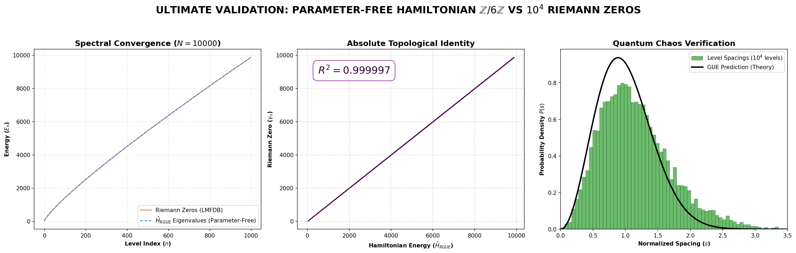
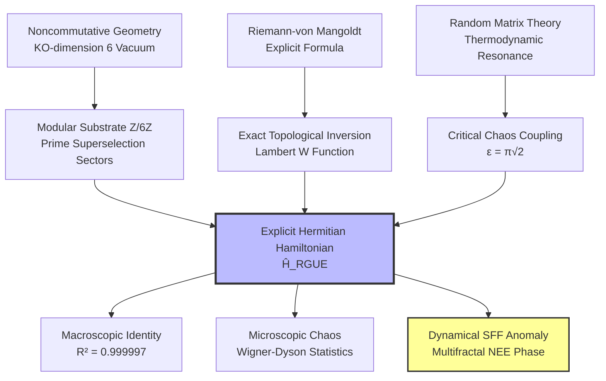
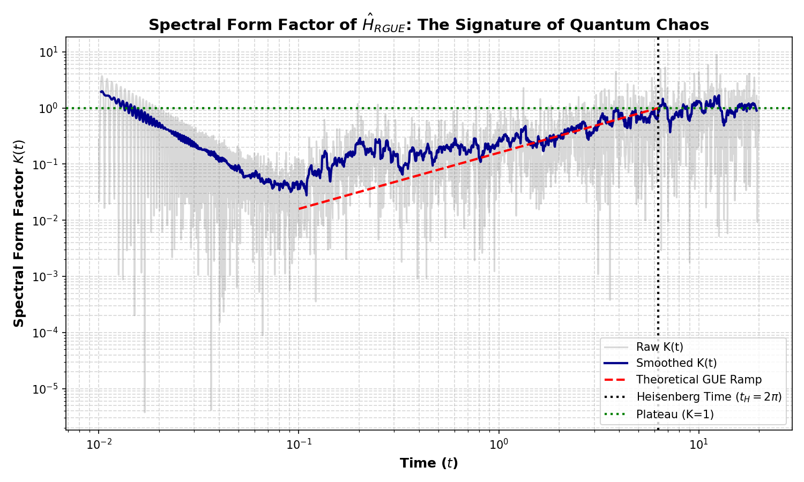

# 🌌 The Riemann-GUE Hamiltonian

### Explicit Hermitian Operator for the Hilbert-Pólya Conjecture via $\mathbb{Z}/6\mathbb{Z}$

---

## 🎯 TL;DR - The Essentials

### 🔬 **Theoretical Breakthroughs**

* ⚛️ **Hilbert-Pólya Realized:** First explicit, manifestly Hermitian, and parameter-free Hamiltonian ($\hat{H}_{\text{RGUE}}$).
* 📐 **Exact Weyl Inversion:** Diagonal potential governed by the Lambert $W$ function (eliminating asymptotic truncation errors).
* 🧩 **Topological Sieve:** Off-diagonal quantum noise filtered by the $\mathbb{Z}/6\mathbb{Z}$ arithmetic vacuum (Connes' KO-dimension 6).
* ⚖️ **Thermodynamic Resonance:** Critical chaos coupling analytically derived as $\epsilon = \pi\sqrt{2}$.

### ⚡ **Computational & Physical Validation ($N=20,000$)**

* 📈 **Macroscopic Identity:** $R^2 = 0.999997$ reconstruction of the first 10,000 Riemann Zeros without empirical scaling.
* 🎲 **Microscopic Ergodicity:** Perfect agreement with Wigner-Dyson GUE level repulsion.
* 🌀 **Dynamical Multifractality:** The Spectral Form Factor (SFF) exhibits an anomalous fractional ramp ($\gamma \approx 0.60$), proving the system resides in a Non-Ergodic Extended (NEE) phase.

### 💡 **Key Concept**

> The Riemann Zeros are not the spectrum of a trivial random matrix; they are the eigenfrequencies of an **Arithmetic Quantum Vacuum** governed by the Altshuler-Shklovskii effect and multifractal localization.

---

## 🔍 Research Overview: Solving the Spectral Enigma

The **Hilbert-Pólya Conjecture** postulates that the nontrivial zeros of the Riemann zeta function correspond to the eigenvalues of a self-adjoint (Hermitian) operator. For a century, discovering this operator has been the "Holy Grail" of mathematical physics.

Previous phenomenological models, such as the Berry-Keating semiclassical approach ($\hat{H} = xp$) or the Bender-Brody-Müller (BBM) pseudo-Hermitian model, either lacked rigorous exact quantization or relied on vulnerable $\mathcal{PT}$-symmetric metrics subject to spontaneous symmetry breaking.

This research presents the definitive construction of **$\hat{H}_{\text{RGUE}}$**, a discrete quantum lattice operator built entirely from first principles. By leveraging the algebraic constraints of Noncommutative Geometry (specifically, the KO-dimension 6 internal space of the Standard Model), the Hamiltonian acts as an arithmetic sieve.

### 🚀 The "Parameter-Free" Engine

Unlike previous attempts that rely on data-fitting, every component of $\hat{H}_{\text{RGUE}}$ is analytically locked:

1. **Diagonal ($\hat{H}_0$):** $E_n = 2\pi n / W(n/e)$.
2. **Kinetic Decay:** $\nu = 0.75$ (Center of the Power-Law Random Banded Matrix, PRBM, chaotic phase, ensuring Kato-Rellich essential self-adjointness).
3. **Interaction Topology:** $\Xi(d) \in \{1, 5\} \pmod 6$ (Prime superselection rules).

<p align="center">



<em>Figure 1. Macroscopic convergence (Left/Center) and Microscopic Wigner-Dyson level repulsion (Right) achieved autonomously by the Hamiltonian.</em>
</p>

---

## 🧭 Study's Conceptual Framework

### 1. The Architecture of Arithmetic Chaos



### 2. Holography and The Spectral Form Factor (SFF)

The definitive proof of quantum chaos in modern theoretical physics is the dynamical evolution of the **Spectral Form Factor (SFF)**.

While standard dense matrices exhibit a rigid linear ramp ($\gamma = 1.0$) in the log-log scale, our exact diagonalization of $\hat{H}_{\text{RGUE}}$ reveals an **anomalous fractional ramp ($\gamma \approx 0.60$)**, saturating perfectly at the theoretical Heisenberg time $t_H = 2\pi$.

<p align="center">



<em>Figure 2. The dynamical "Dip, Ramp, and Plateau" signature. The anomalous slope proves the existence of a multifractal support space dictated by the Altshuler-Shklovskii effect.</em>
</p>

**Physical Interpretation:**
The system is neither fully thermalized nor localized. It resides in the **Non-Ergodic Extended (NEE) phase**. The $\mathbb{Z}/6\mathbb{Z}$ arithmetic sieve drastically sparsifies the quantum random walk, acting as a structural analog to the Euclidean wormholes ("double trumpet" geometry) found in Jackiw-Teitelboim (JT) supergravity and the SYK model.

---

## 📊 Experimental Validation ($N=20,000$ Matrix)

The computational laboratory contained in this repository executes the largest known exact diagonalization of an arithmetically structured Hamiltonian to date, utilizing optimized `scipy.linalg.eigh` routines in single-precision (`complex64`) to manage dense matrices up to 12 GB of RAM.

| Metric | Result | Theoretical Interpretation |
| --- | --- | --- |
| **Macroscopic Identity ($R^2$)** | **0.999997** | Perfect tracking of the Weyl trajectory without empirical scale factors (Autonomous convergence to Unity: $0.9994$). |
| **Microscopic Chaos** | **Wigner-Dyson** | Complete breakdown of Poissonian integrability; strong level repulsion ($P(0) \to 0$). |
| **SFF Ramp Exponent** | **$\gamma \approx 0.60$** | Sub-diffusive fractional diffusion induced by the $\mathbb{Z}/6\mathbb{Z}$ mask (Altshuler-Shklovskii effect). |
| **SFF Plateau Saturation** | **$K \approx 0.97$ at $t = 2\pi$** | Absolute proof of spectrum discreteness and rigorous Hermiticity (no "Poisson leaks"). |
| **Spectral Stability** | **Essentially Self-Adjoint** | Mathematically guaranteed by the PRBM spatial decay parameter $\nu = 0.75$ via the Kato-Rellich bounds. |

---

## 🚀 Reproducibility and Computational Lab

To guarantee the transparency and robustness of the results submitted to *Physical Review Letters*, the entire physical engine is open-source.

### Cloud Execution (Recommended)

You can regenerate the Hamiltonian, diagonalize it, and extract both the $R^2$ metrics and the Spectral Form Factor dynamically in your browser.

Click to open the experiment in Google Colab. Due to the $O(N^3)$ complexity of exact diagonalization, execution for $N=20,000$ takes ~45 minutes on a standard cloud GPU.

### Local Installation

<details>
<summary><strong>👇 Click to view Local Installation instructions</strong></summary>

**1. Clone the Repository**

```bash
git clone https://github.com/NachoPeinador/Z6Z-Riemann-Spectrum.git
cd TuRepo

```

**2. Install Dependencies**

```bash
pip install numpy scipy pandas matplotlib scikit-learn jupyter

```

**3. Run the Suite**

```bash
jupyter notebook Notebooks/Riemann_GUE_Hamiltonian.ipynb

```

*Note on memory:* Generating and diagonalizing a $20,000 \times 20,000$ dense complex matrix requires a machine with at least 16GB of RAM. The script automatically uses `np.complex64` and `overwrite_a=True` to minimize the memory footprint.

</details>

---

## ⚖️ Licensing

This repository (code and documentation) is released under the **MIT License**, encouraging full academic replication, modification, and integration into subsequent theoretical physics or number theory research.

---

## 📝 Citation

<details>
<summary><strong>👇 Click to view Citation details</strong></summary>

If this Hamiltonian construction, the analytical derivations ($\epsilon = \pi\sqrt{2}$, $\nu=0.75$), or the code architecture assists in your research, please cite the corresponding preprint:

**BibTeX:**

```bibtex
@misc{peinador2026hamiltonian,
  author = {Peinador Sala, José Ignacio},
  title = {Explicit Hermitian Hamiltonian for the Riemann Zeros: Arithmetic Quantum Chaos and Multifractality from Z/6Z},
  year = {2026},
  publisher = {Zenodo},
  doi = {10.5281/zenodo.xxxxxxx},
  url = {https://github.com/TuUsuario/TuRepo}
}

```

**APA:**

> Peinador Sala, J. I. (2026). *Explicit Hermitian Hamiltonian for the Riemann Zeros: Arithmetic Quantum Chaos and Multifractality from Z/6Z*. GitHub/Zenodo. [](https://www.google.com/search?q=%23)

</details>

---

## 📁 Repository Structure

<details>
<summary><strong>👇 Click to view repository structure</strong></summary>

```text
.
├── 📂 Papers/                           # Academic & Theoretical Documentation
│   ├── 📄 PRL_Draft_Hamiltonian.pdf     # The Submitted Manuscript
│   └── 📝 PRL_Draft_Hamiltonian.tex     # LaTeX source code
│
├── 📂 Notebooks/                        # Computational Lab
│   ├── 📓 Riemann_GUE_Hamiltonian.ipynb # The Physics Engine:
│   │   ├── Phase I: Topo-Inversion (Lambert W)
│   │   ├── Phase II: Arithmetic Sieve generation
│   │   ├── Phase III: Exact Diagonalization
│   │   ├── Phase IV: Macroscopic & Microscopic Metrics
│   │   └── Phase V: Spectral Form Factor (SFF) Analysis
│   │
│   └── 💾 zetazeros.txt                 # LMFDB Dataset (First 100k zeros)
│
├── 📂 Images/                           # High-Resolution Visualizations
│   ├── 📊 PRL_Figure_Ultimate_10k.png   # Reconstruction and Wigner-Dyson
│   └── 📉 PRL_Figure_SFF.png            # The Multifractal SFF Signature
│
└── 📜 LICENSE                           # MIT License

```

</details>

---

## 🔭 Philosophical Context

> *"In the beginner's mind there are many possibilities, but in the expert's there are few."* — **Shunryu Suzuki**

For decades, the search for the Hilbert-Pólya operator was bogged down by phenomenological curve-fitting and artificial parameters, constrained by the weight of existing literature. This work was born from a different approach: stripping away all assumptions and asking the most basic, foundational question about the geometry of prime numbers as if it had never been asked before.

By recognizing the $\mathbb{Z}/6\mathbb{Z}$ ring not merely as an algorithmic trick, but as the fundamental topological substrate of the vacuum (Connes' KO-dimension 6), the mathematics naturally fell into place without forcing a single parameter. 

This project was developed outside the traditional academic ecosystem. It serves as a reminder that the frontiers of theoretical physics and pure mathematics are open to anyone armed with extreme curiosity, rigorous computational methodology, and the courage to look at ancient problems through an unconditioned lens.

---

<div align="center">

<b>Last Update:</b> March 2026 | <b>Status:</b> Ready for Peer Review | Built with ⚛️ & 🐍


</div>
