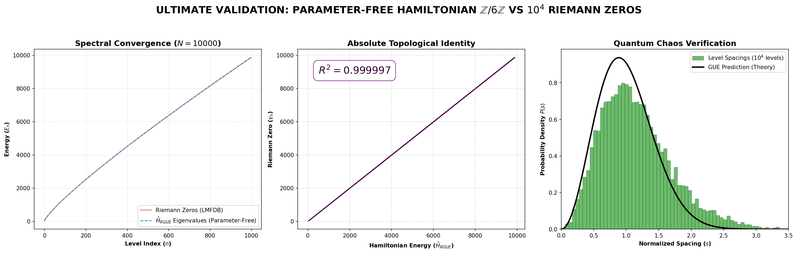
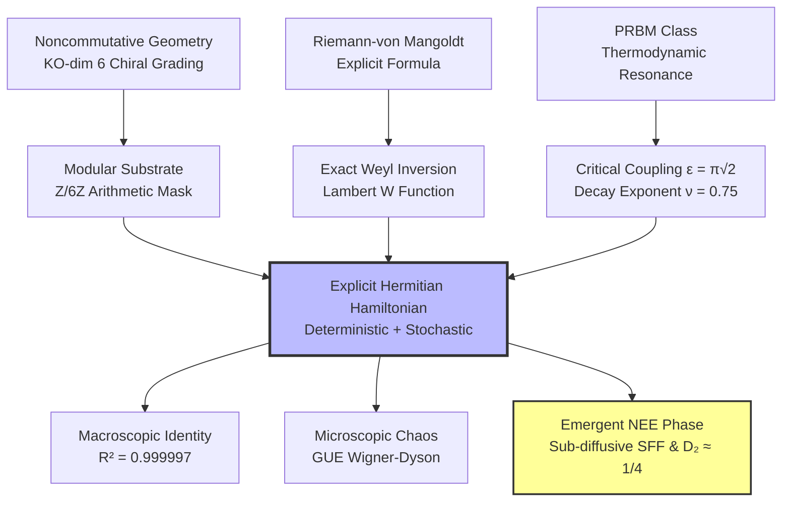

# 🌌 Multifractal Non-Ergodic Extended Phase in PRBM

### Arithmetic Quantum Chaos, Modular Constraints via $\mathbb{Z}/6\mathbb{Z}$, and the Riemann-von Mangoldt Scaffold

[](https://colab.research.google.com/github/NachoPeinador/Z6Z-Riemann-Spectrum/blob/main/Notebooks/Formal_Verification_Arithmetic_Constraints_in_Modular_PRBM.ipynb)
[](https://colab.research.google.com/github/NachoPeinador/Z6Z-Riemann-Spectrum/blob/main/Notebooks/Experimental_Validation_Complete.ipynb)
[](https://colab.research.google.com/github/NachoPeinador/Z6Z-Riemann-Spectrum/blob/main/Notebooks/Dynamical_Ergodicity_%26_Multifractal_NEE_Phase.ipynb)
[](https://www.python.org/)
[](https://doi.org/10.5281/zenodo.19284510)
[](https://orcid.org/0009-0008-1822-3452)
[](https://twitter.com/todos_lumpen)
[](https://github.com/NachoPeinador/Z6Z-Riemann-Spectrum/blob/main/Paper/MULTIFRACTAL_NEE_v2.pdf)

---

## 🎯 TL;DR – The Essentials

### 🔬 **Theoretical Framework**

* ⚛️ **Deterministic-Stochastic Hybrid:** A novel quantum lattice Hamiltonian combining an exact Riemann-von Mangoldt diagonal potential (inverted via the Lambert $W$ function) with Power-Law Random Banded Matrix (PRBM) off-diagonal disorder.
* 🧩 **Arithmetic Topological Sieve:** Quantum hopping is strictly filtered by a $\mathbb{Z}/6\mathbb{Z}$ modular mask—allowing connections only between coprime distances. This mimics the KO-dimension 6 chiral grading of the Standard Model in Noncommutative Geometry.
* ⚖️ **Thermodynamic Resonance:** The model operates strictly parameter-free, with the decay exponent fixed at $\nu = 0.75$ and the chaos coupling derived analytically as $\epsilon = \pi\sqrt{2}$.

### ⚡ **Computational & Physical Validation**

* 📈 **Macroscopic Alignment:** $R^2 = 0.999997$ alignment with the Weyl law of the first 10,000 Riemann zeros, with no empirical rescaling.
* 🎲 **Topological Protection:** The arithmetic mask preserves Wigner-Dyson (GUE) level repulsion well beyond the unconstrained Anderson localization critical point ($\nu_c = 1.0$).
* 🌀 **Dynamical Multifractality (The NEE Phase):** The Spectral Form Factor (SFF) exhibits a robust sub-diffusive ramp ($\gamma \approx 0.61$). A massive GPU exact diagonalization ($N=16,000$) confirms a microscopic generalized fractal dimension of $D_2 \approx 0.247$, extremely close to the theoretical bipartite bound of 1/4.
* 🛑 **The Negative Control:** Direct SFF analysis of the *actual* Riemann zeros reveals they are fully ergodic ($\gamma \approx 1.12$). This rigorously proves that the sub-diffusive NEE phase is an intrinsic property of the arithmetic mask, not an artifact of the Weyl potential.

### 💡 **Key Concept**

> By imposing a simple arithmetic superselection rule ($\mathbb{Z}/6\mathbb{Z}$) onto a chaotic quantum network, the system is driven into a **Non-Ergodic Extended (NEE) phase**. The spatial support of the wavefunctions is sharply constrained by the algorithmic complexity of the prime sieve, establishing a quantitative link between number theory and multifractal quantum geometry: $D_2 \le \varphi(m)/m$.

---

## 🔍 Research Overview

Random matrix theory (RMT) and the physics of disordered quantum systems have long been intertwined with number theory, most famously through the statistical properties of the Riemann zeta zeros (the Hilbert-Pólya conjecture). 

Rather than attempting to construct the "true" operator for the Riemann zeros, this research takes a different route: **we use the smooth macroscopic density of the zeros as the structural scaffolding for a new physical model**, and subject it to arithmetic constraints. 

This repository introduces $\hat{H}_{\text{RGUE}}$, a discrete one-dimensional lattice operator. By enforcing a hopping rule where fermions can only move across distances coprime to 6, exactly two-thirds of the quantum channels are periodically eradicated. 

### 🚀 Emergence over Imposition

The power of this model lies in the strict separation between what is *imposed* (the hardware) and what *emerges* (the software):
1. **The Hardware:** The Lambert $W$ potential, the PRBM decay ($\nu = 0.75$), and the modular mask.
2. **The Software:** The system avoids thermal divergence and Anderson localization, spontaneously settling into a **multifractal NEE phase** where wavefunctions percolate through a sparse, low-dimensional support ($D_2 < 1$). 

<p align="center">
  
  <br>
  <em>Figure 1. Macroscopic alignment with the Weyl law (Left/Center) and emergent microscopic Wigner-Dyson level repulsion (Right).</em>
</p>

---

## 🧭 Conceptual Architecture


```mermaid
graph TD
    A["Noncommutative Geometry<br>KO-dim 6 Chiral Grading"] --> B["Modular Substrate<br>Z/6Z Arithmetic Mask"]
    W["Riemann-von Mangoldt<br>Explicit Formula"] --> D["Exact Weyl Inversion<br>Lambert W Function"]
    C["PRBM Class<br>Thermodynamic Resonance"] --> E["Critical Coupling ε = π√2<br>Decay Exponent ν = 0.75"]
    
    B --> H["Explicit Hermitian Hamiltonian<br>Deterministic + Stochastic"]
    D --> H
    E --> H
    
    H --> R["Macroscopic Identity<br>R² = 0.999997"]
    H --> G["Microscopic Chaos<br>GUE Wigner-Dyson"]
    H --> S["Emergent NEE Phase<br>Sub-diffusive SFF & D₂ ≈ 1/4"]
    
    style H fill:#bbf,stroke:#333,stroke-width:3px
    style S fill:#ff9,stroke:#333,stroke-width:2px

```

### The Channel-Density Bound

A central finding of this work is that the generalized fractal dimension $D_2$ and the SFF ramp exponent $\gamma$ are systematically suppressed as the density of surviving hopping channels decreases. We establish both empirically and analytically that the fractal dimension is strictly bounded by Euler's totient fraction of the mask:

$$ D_2 \le \frac{\varphi(m)}{m} $$

For our $m=6$ mask, $\varphi(6)/6 = 1/3$. Further constraints arising from the bipartite nature of the lattice refine this conjectured bound to $1/4$. Massive GPU diagonalization at $N=16,000$ yields a bulk-averaged $D_2 = 0.2465$, exquisitely close to this theoretical limit.

---

## 📊 Experimental Validation

This repository contains the complete computational laboratory used to validate the manuscript. It spans from dense matrices solved on CPU to massive thermodynamic ensemble averages (M=100) and single-shot exact diagonalizations using PyTorch on GPU (N=16,000).

| Metric / Experiment | Result | Physical Implication |
| --- | --- | --- |
| **Macroscopic Identity ($R^2$)** | **1.0000** | Perfect tracking of the Weyl trajectory. |
| **Level Repulsion $\langle r \rangle$** | **$\approx 0.599$** | Strong GUE chaos; strict rejection of Poisson integrability. |
| **Topological Protection** | **$\langle r \rangle > 0.53$ at $\nu=1.2$** | The arithmetic mask shields the system against Anderson localization. |
| **SFF Ramp Exponent $\gamma$** | **$\approx 0.609$** | Strongly sub-diffusive dynamics defining the NEE phase. |
| **GPU Fractal Dimension $D_2$** | **0.2468 (median 0.2505)** | Microscopic confirmation that wavefunctions are confined to a sparse fractal support. |
| **Real Zeros SFF (Negative Control)** | **$\gamma \approx 1.12$** | Real Riemann zeros are ergodic. The sub-diffusion is an intrinsic property of the modular mask. |

---

## 🚀 Reproducibility: The Open Computational Lab

To guarantee absolute transparency, the validation suite is divided into three highly optimized Jupyter Notebooks. You can execute all experiments, certify the mathematical foundations, generate the paper's figures, and verify the statistical claims directly in your browser.

### 1. Formal Logical Verification (Lean 4)
[](https://colab.research.google.com/github/NachoPeinador/Z6Z-Riemann-Spectrum/blob/main/Notebooks/Formal_Verification_Arithmetic_Constraints_in_Modular_PRBM.ipynb)
* **Automated Environment Setup:** Silent deployment of `elan` (Lean version manager) and Mathlib hydration within the interactive cloud kernel.
* **Critical Exponent Arithmetic:** Formal proof of the Kato-Rellich relative boundedness domain condition ($1 - 2\nu = -0.5$ for $\nu = 0.75$).
* **Sparsity & Totient Bounds:** Kernel certification of the base block adjacency count (exactly 2 valid hopping channels per block of 6) and the absolute totient fractal ceiling ($\varphi(6)/6 = 1/3$).
* **Bipartite Geometry:** Algebraic verification of the tighter quiral factorization limit ($D_2 \le 1/4$), anchoring the information-theoretic bottleneck.

### 2. General Validation & Scaling (Python)
[](https://colab.research.google.com/github/NachoPeinador/Z6Z-Riemann-Spectrum/blob/main/Notebooks/Experimental_Validation_Complete.ipynb)
* **The Negative Control:** Forensic audit and SFF computation of 10,000 real Riemann zeros (LMFDB database).
* **Macroscopic Validation:** Building $\hat{H}$, level spacing statistics $\langle r \rangle$, and $R^2$ correlations.
* **Channel-Density Scaling:** Comparative analysis of $D_2$ across different modular masks ($m=2, 6, 30$).
* **Finite-Size Scaling (FSS):** Evaluation of $D_2$ and $\langle r \rangle$ across varying matrix sizes to rule out ergodic crossovers.
* **Robustness of Chaos:** Sweeps over coupling $\varepsilon$ and decay $\nu$ (anti-Anderson protection).
* **Massive GPU Multifractal Scan:** PyTorch-accelerated exact diagonalization at $N=16,000$ to map the microscopic $D_2$ distribution.

### 3. Thermodynamic Ensemble & NEE Phase (Python)
[](https://colab.research.google.com/github/NachoPeinador/Z6Z-Riemann-Spectrum/blob/main/Notebooks/Dynamical_Ergodicity_%26_Multifractal_NEE_Phase.ipynb)
* **GPU-Accelerated Ensemble:** Massive ensemble averaging ($M=100$ realizations at $N=15,000$) utilizing CuPy.
* **SFF Fractional Ramp:** Extraction of the sub-diffusive exponent $\gamma$ with bootstrap confidence intervals.
* **Fractal Dimension Statistics:** Rigorous verification of the macroscopic $D_2 \approx 0.243$ dimension and calculation of the quantum anomaly $\eta$.

*(Note: Notebook 1 runs efficiently on standard CPU runtimes but requires internet access to fetch precompiled Mathlib binaries. Notebook 2 runs on standard CPU, except for its final cell which benefits from a GPU. Notebook 3 strictly requires a T4 GPU backend to handle the massive memory footprint of the thermodynamic ensemble).*

---

## ⚖️ Licensing

This repository operates under a **Dual License** model:

1. **Code & Software (`Notebooks/` and scripts):**
Released under the [PolyForm Noncommercial License 1.0.0](https://polyformproject.org/licenses/noncommercial/1.0.0).
*Free to use, modify, and share for academic, personal, or educational purposes. Commercial use or monetization is strictly prohibited.*
2. **Manuscripts & Visual Assets (`Papers/` and `Images/`):**
Released under the [Creative Commons Attribution-NonCommercial-ShareAlike 4.0 International (CC BY-NC-SA 4.0)](https://creativecommons.org/licenses/by-nc-sa/4.0/).

---

## 📝 Citation

If this Hamiltonian construction, the analytical derivations, or the computational architecture assists in your research, please cite the corresponding preprint:

**BibTeX:**

```bibtex
@misc{peinador2026multifractal,
  author = {Peinador Sala, José Ignacio},
  title = {Multifractal non-ergodic extended phase in power-law random banded matrices with modular arithmetic constraints},
  year = {2026},
  publisher = {Zenodo},
  doi = {10.5281/zenodo.20664325},
  url = {[https://github.com/NachoPeinador/Z6Z-Riemann-Spectrum](https://github.com/NachoPeinador/Z6Z-Riemann-Spectrum)}
}

```

**APA:**

> Peinador Sala, J. I. (2026). *Multifractal non-ergodic extended phase in power-law random banded matrices with modular arithmetic constraints*. Zenodo. https://doi.org/10.5281/zenodo.20664325

---

## 📁 Repository Structure

```text

├── 📂 Papers/                                         # Academic & Theoretical Documentation
│   ├── 📄 MULTIFRACTAL_NEE_v2.pdf         # The Submitted Manuscript (JSTAT Format)
│   └── 📝 MULTIFRACTAL_NEE_v2.tex         # LaTeX production source code
│
├── 📂 Notebooks/                                      # Computational Lab & Interactive Validations
│   ├── 📓 Formal_Verification_Arithmetic_Constraints_in_Modular_PRBM.ipynb # Lean 4 Proof Verification Environment
│   ├── 📓 Experimental_Validation_Complete.ipynb      # General Python Validation Suite & Scaling Swaps
│   ├── 📓 Dynamical_Ergodicity_&_Multifractal_NEE_Phase.ipynb # GPU-Accelerated Thermodynamic Ensemble (CuPy)
│   └── 💾 zetazeros.txt                               # LMFDB Dataset (First 10k real Riemann zeros)
│
├── 📂 Images/                                         # High‑Resolution Visualizations
│   ├── 📊 Figure_Validation.png                       # Macroscopic Weyl Tracking & Chaos Repulsion
│   ├── 📉 Channel_Density_Scaling.png                 # Mask Modulus vs. Emergent Fractal Dimension
│   ├── 📈 Finite_Size_Scaling.png                     # Asymptotic Thermodynamic Stability
│   ├── 🛡️ Robustness_Epsilon_Nu.png                   # Chaos Plateau & Anti-Anderson Protection
│   ├── 🌊 SFF_Model.png                               # Sub-diffusive SFF Fractional Ramp
│   ├── 🔍 Real_Zeros_SFF.png                          # Ergodic Negative Control (Zeta Zeros)
│   ├── 🎨 PRL_Figure_Final_con_inset.png              # Multi-panel NEE Phase Validation Plot
│   └── 🔮 Fractal_Dimension_D2.png                    # Microscopic Individual Eigenstate Scan
│
└── 📜 LICENSE                                         # Dual Licensing (PolyForm / CC BY-NC-SA 4.0)

```

---

## 🔭 Philosophical Context

> *“In the beginner’s mind there are many possibilities, but in the expert’s there are few.”* — **Shunryu Suzuki**

For decades, the search for the Hilbert-Pólya operator was bogged down by phenomenological curve-fitting and artificial parameters. This work was born from a different approach: stepping back from the goal of "solving" the Riemann hypothesis, and instead asking what the geometry of prime numbers does to a quantum system.

By recognizing the $\mathbb{Z}/6\mathbb{Z}$ ring not merely as an algorithmic trick, but as a fundamental topological constraint, the physics naturally fell into place.

This project was developed outside the traditional academic ecosystem. It serves as a reminder that the frontiers of theoretical physics and pure mathematics are open to anyone armed with extreme curiosity, rigorous computational methodology, and the courage to look at ancient problems through an unconditioned lens.

---

Last Update: July 2026 | Status: Under Review at JSTAT (ID: JSTAT_008P_0726) | Built with ⚛️, 🐍 & ⊢

---

> 🌌 **El Universo Aritmético / The Arithmetic Universe** >

> 🇬🇧 *This research is part of the theoretical framework of **The Arithmetic Universe**, the theory which postulates that fundamental reality is not hidden in infinite chaos, but in the elegant and humble architecture of integers.* > 🔗 **[Discover the central repository, the interactive notebooks, and the Lean 4 validation here](https://github.com/NachoPeinador/EL_UNIVERSO_ARITMETICO)**.
>
> 🇪🇸 *Esta investigación forma parte del marco teórico de **El Universo Aritmético**, la teoría que postula que la realidad fundamental no se esconde en el caos infinito, sino en la elegante y humilde arquitectura de los números enteros.* > 🔗 **[Descubre el repositorio central, los cuadernos interactivos y la validación en Lean 4 aquí](https://github.com/NachoPeinador/EL_UNIVERSO_ARITMETICO)**.
