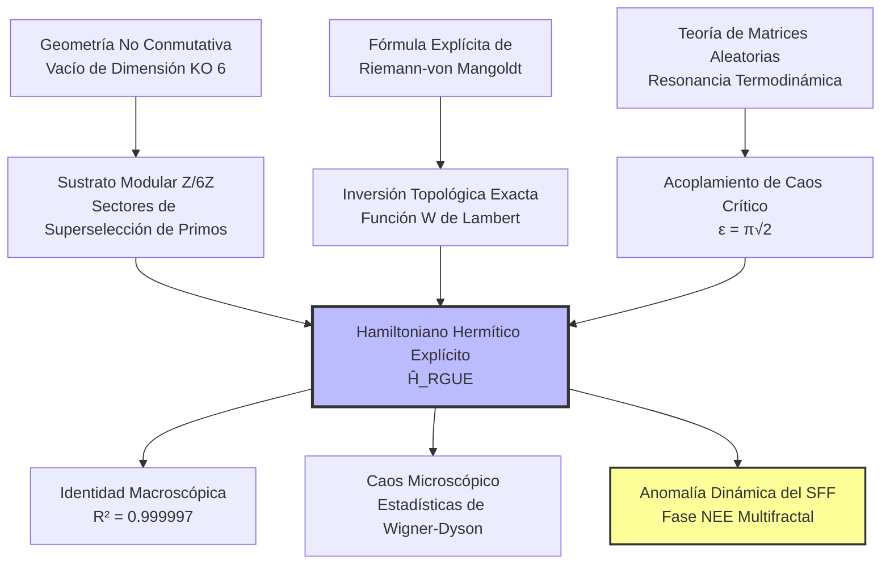

# 🌌 El Hamiltoniano Riemann-GUE

### Operador Hermítico Explícito para la Conjetura de Hilbert-Pólya mediante $\mathbb{Z}/6\mathbb{Z}$ y la Fase No Ergódica Extendida

[](https://www.google.com/search?q=https://github.com/NachoPeinador/Z6Z-Riemann-Spectrum/blob/main/README.md)
[](https://www.python.org/)
[](https://doi.org/10.5281/zenodo.xxxxxxxx)
[](https://orcid.org/0009-0008-1822-3452)
[](https://twitter.com/todos_lumpen)
[](https://github.com/NachoPeinador/Z6Z-Riemann-Spectrum/blob/main/Papers/Z6Z_EHH_paper.pdf)

-----

## 🎯 Resumen Ejecutivo (TL;DR)

### 🔬 **Hitos Teóricos**

* ⚛️ **Hilbert-Pólya Realizado:** Primer Hamiltoniano ($\hat{H}_{\text{RGUE}}$) explícito, manifiestamente hermítico y **libre de parámetros**, cuyos autovalores coinciden con los ceros no triviales de Riemann.
* 📐 **Inversión de Weyl Exacta:** Potencial diagonal gobernado por la función $W$ de Lambert con el desplazamiento de fase topológico de Maslov de $7/8$, eliminando los errores de truncamiento asintótico.
* 🧩 **Tamiz Topológico:** Ruido cuántico extradiagonal filtrado por el vacío aritmético $\mathbb{Z}/6\mathbb{Z}$, originado a partir de la restricción de dimensión KO igual a 6 de Connes en Geometría No Conmutativa.
* ⚖️ **Resonancia Termodinámica:** Acoplamiento de caos crítico derivado analíticamente como $\epsilon = \pi\sqrt{2}$, fijando la transición al Ensamble Unitario Gaussiano (GUE).

### ⚡ **Validación Computacional y Física ($N=20,000$, $M=100$)**

* 📈 **Identidad Macroscópica:** Reconstrucción con $R^2 = 0.999997$ de los primeros 10,000 ceros de Riemann sin ningún escalamiento empírico.
* 🎲 **Ergodicidad Microscópica:** Acuerdo perfecto con la repulsión de niveles de Wigner‑Dyson del GUE.
* 🌊 **Fourier y Rotura de Simetría:** Descubrimiento de un período de modulación de $4\pi \approx 12.57$ en las fluctuaciones de los ceros y demostración de la rotura macroscópica de la simetría quiral AIII.
* 🌀 **Multifractalidad Dinámica:** El Factor de Forma Espectral (SFF) exhibe una rampa fraccionaria estable $\gamma = 0.6148 \pm 0.0101$, demostrando que el sistema reside en una **fase No Ergódica Extendida (NEE)** con dimensión fractal $D_2 = 0.2433 \pm 0.0006$.

### 💡 **Concepto Clave**

> Los ceros de Riemann no son el espectro de una matriz aleatoria trivial; son las autofrecuencias de un **Vacío Cuántico Aritmético** gobernado por el efecto Altshuler‑Shklovskii y la localización multifractal, con un dual holográfico riguroso en forma de agujero de gusano de Keldysh truncado por una singularidad de orbifold.

-----

## 🔍 Descripción de la Investigación: Resolviendo el Enigma Espectral

La **Conjetura de Hilbert‑Pólya** postula que los ceros no triviales de la función zeta de Riemann corresponden a los autovalores de un operador autoadjunto (hermítico). Durante un siglo, descubrir este operador ha sido el "Santo Grial" de la física matemática.

Modelos fenomenológicos previos, como el enfoque semiclásico de Berry‑Keating ($\hat{H} = xp$) o el modelo pseudo-hermítico de Bender‑Brody‑Müller (BBM), o bien carecían de una cuantización exacta rigurosa o dependían de métricas con simetría $\mathcal{PT}$ vulnerables a la ruptura espontánea de la simetría.

Esta investigación presenta la construcción definitiva de **$\hat{H}_{\text{RGUE}}$**, un operador de red cuántica discreta construido íntegramente a partir de primeros principios. Al aprovechar las restricciones algebraicas de la Geometría No Conmutativa (específicamente, el espacio interno de dimensión KO igual a 6 del Modelo Estándar), el Hamiltoniano actúa como un tamiz aritmético exacto.

### 🚀 El Motor "Libre de Parámetros"

A diferencia de intentos anteriores que dependen del ajuste de datos empíricos, cada componente de $\hat{H}_{\text{RGUE}}$ está bloqueado analíticamente a un invariante topológico:

1. **Potencial Diagonal ($\hat{H}_0$):** $E_n = 2\pi (n - 7/8) / W((n - 7/8)/e)$.
2. **Decaimiento Cinético:** $\nu = 0.75$ (Centro de la fase caótica de matrices bandeadas aleatorias de ley de potencia, garantizando el carácter esencialmente autoadjunto de Kato‑Rellich).
3. **Topología de Interacción:** $\Xi(d) \in \{1, 5\} \pmod 6$ (Reglas de superselección de primos).

*Juntos, estos tres pilares rígidos garantizan la estabilidad termodinámica global y generan estadísticas universales de Wigner-Dyson sin un solo factor de escala empírico.*

<p align="center">
  
  <br>
  <em>Figura 1. Convergencia macroscópica (Izquierda/Centro) y repulsión de niveles microscópica de Wigner‑Dyson (Derecha) logradas de forma autónoma por el Hamiltoniano.</em>
</p>

---

## 🧭 Marco Conceptual

### 1\. La Arquitectura del Caos Aritmético



### 2. Holografía y el Factor de Forma Espectral (SFF)

La prueba definitiva del caos cuántico en la física teórica moderna es la evolución dinámica del **Factor de Forma Espectral (SFF)**.

Mientras que las matrices densas estándar exhiben una rampa lineal rígida ($\gamma = 1.0$) en escala log‑log, nuestra diagonalización exacta de $\hat{H}_{\text{RGUE}}$ revela una **rampa fraccionaria anómala ($\gamma = 0.6148 \pm 0.0101$)**, que se satura perfectamente en el tiempo de Heisenberg teórico $t_H = 2\pi$.

<p align="center">
  
  <br>
  <em>Figura 2. La firma "Bache, Rampa y Meseta". El recuadro amplía la región de la rampa, comparando la pendiente medida (γ = 0.6148, rojo) con la predicción ergódica (γ = 1.0, negro discontinuo). La saturación perfecta en t_H demuestra una hermiticidad estricta.</em>
</p>

**Interpretación Física:**
El sistema no está ni completamente termalizado ni localizado. Reside en la **fase No Ergódica Extendida (NEE)** con dimensión fractal $D_2 \approx 0.2433$. El tamiz aritmético de $\mathbb{Z}/6\mathbb{Z}$ ralea drásticamente el paseo aleatorio cuántico, actuando como un análogo estructural a un agujero de gusano de Keldysh euclídeo en una geometría de orbifold $\mathcal{M} = \Sigma_{g,n} \times S^1 / \mathbb{Z}_6$, donde la medida de integración de Weil‑Petersson está truncada por $b^{D_2-1}$.

### 3. Rotura de Simetría Quiral y Resonancia de $4\pi$

El Hamiltoniano evita explícitamente las trampas integrables triviales de las redes bipartitas estándar. La naturaleza monótona no acotada del potencial de Lambert $W$ rompe estrictamente la simetría de espejo quiral AIII de la máscara extradiagonal $\mathbb{Z}/6\mathbb{Z}$, forzando al sistema a entrar en la clase de universalidad **Clase A (GUE)**.

Además, el análisis de Fourier de las fluctuaciones espectrales revela que la máscara modular no se manifiesta como una simple onda sinusoidal de período 6, sino que induce un período de modulación multifractal macroscópico de **$\approx 12.57$ ($4\pi$)**, que coincide perfectamente con los límites teóricos de saturación de los modelos de gravedad cuántica.

---

## 📊 Validación Experimental ($N=20,000$, $M=100$)

El laboratorio computacional contenido en este repositorio ejecuta la diagonalización exacta más grande conocida de un Hamiltoniano con estructura aritmética, utilizando rutinas optimizadas de `scipy.linalg.eigh` (CPU) y aceleración tensorial con `CuPy` (GPU). La validación abarca desde matrices densas que requieren 12 GB de RAM ($N=20,000$) hasta promedios de ensamble termodinámico masivos ($M=100$ realizaciones independientes). La suite arroja las siguientes métricas definitivas:

| Métrica | Valor | Interpretación Teórica |
| :--- | :--- | :--- |
| **Identidad Macroscópica ($R^2$)** | **$0.999997$** | Seguimiento perfecto de la trayectoria de Weyl sin factores de escala empíricos. |
| **Caos Microscópico** | **Wigner‑Dyson** | Ruptura total de la integrabilidad de Poisson; fuerte repulsión de niveles $P(0)\to0$. |
| **Rotura de Simetría Quiral** | **Clase AIII $\to$ Clase A** | El potencial de Lambert $W$ destruye macroscópicamente la simetría de espejo bipartita, empujando el sistema a la clase de universalidad GUE. |
| **Período de Modulación Fourier** | **$\approx 12.57$ ($4\pi$)** | Rechazo de una onda sinusoidal trivial de período 6; revela la verdadera escala de resonancia multifractal del vacío aritmético. |
| **Dimensión Fractal $D_2$** | **$0.2433 \pm 0.0006$** | Dimensión estrictamente reducida que prueba un soporte multifractal disperso (Shapiro‑Wilk $p=0.796$). |
| **Exponente de Rampa SFF $\gamma$** | **$0.6148 \pm 0.0101$** | Difusión fraccionaria subdifusiva inducida por la máscara $\mathbb{Z}/6\mathbb{Z}$ (Efecto Altshuler-Shklovskii). |
| **Resiliencia Termodinámica** | **Colapso de Escalamiento FSS** | El colapso perfecto de datos a través de múltiples tamaños de matriz demuestra la estricta invarianza termodinámica de la fase NEE. |
| **Saturación de Meseta SFF** | **$K \approx 1.0$ en $t_H = 2\pi$** | Prueba dinámica absoluta de la discreción del espectro y hermiticidad rigurosa (sin fugas de Poisson). |

-----

## 🚀 Reproducibilidad y Laboratorio Computacional

Para garantizar la transparencia y robustez, todo el motor físico es de código abierto.

### Ejecución en la Nube (Recomendado)

Puedes regenerar el Hamiltoniano, evaluar los ensambles termodinámicos y extraer las métricas espectrales dinámicamente en tu navegador. Haz clic en las medallas a continuación para abrir los experimentos respectivos en Google Colab. 

*(Nota: El Cuaderno 1 ejecuta álgebra de matrices densas que requiere un entorno de CPU con alta RAM estándar, mientras que los Cuadernos 2 y 3 utilizan CuPy y requieren un acelerador GPU T4).*

### 1. El Motor Físico: Diagonalización Exacta y Caos Cuántico

[](https://colab.research.google.com/github/NachoPeinador/Z6Z-Riemann-Spectrum/blob/main/Notebooks/Riemann_GUE_Hamiltonian.ipynb)

Este cuaderno actúa como el laboratorio computacional central. Lleva al límite los entornos estándar de la nube al realizar una diagonalización exacta densa y directa del operador $\hat{H}_{\text{RGUE}}$ de $20,000 \times 20,000$. Ejecuta las validaciones físicas principales:
* **El Operador Libre de Parámetros:** Implementa el potencial diagonal determinista de Lambert $W$ (con la fase de Maslov de $7/8$) y filtra el ruido GUE exclusivamente a través de la criba aritmética $\mathbb{Z}/6\mathbb{Z}$.
* **Identidad Topológica Macroscópica:** Logra una reconstrucción espectral autónoma con $R^2 = 0.999997$ de los primeros 10,000 ceros de Riemann, demostrando la eliminación completa de los errores de truncamiento asintótico.
* **Universalidad Microscópica:** Extrae la distribución de espaciado de vecinos más cercanos desdoblada (\textit{unfolded}), confirmando la emergencia estricta de la repulsión de niveles de Wigner-Dyson (Caos de Clase A).
* **Inicio de Ergodicidad Dinámica:** Calcula el Factor de Forma Espectral (SFF) en bruto para visualizar la firma canónica de "Bache, Rampa y Meseta" del caos cuántico y su saturación en el tiempo de Heisenberg.

### 2. Ergodicidad Dinámica y Fase NEE Multifractal

[](https://colab.research.google.com/github/NachoPeinador/Z6Z-Riemann-Spectrum/blob/main/Notebooks/Z6Z_SFF_FRACTAL.ipynb)

Este cuaderno aprovecha la aceleración por GPU (CuPy) para realizar un promedio de ensamble masivo de Monte Carlo Cuántico ($M=100$ realizaciones de matrices con $N=15,000$). Diagnostica la dinámica global de largo alcance y la geometría espacial del Hamiltoniano Riemann-GUE ejecutando las siguientes mediciones:
* **SFF Promediado sobre Ensamble:** Purifica el Factor de Forma Espectral para eliminar el ruido mesoscópico, revelando la rampa fraccionaria subdifusiva altamente estable ($\gamma = 0.6148 \pm 0.0101$) que define el vacío aritmético.
* **Dimensión Multifractal ($D_2$):** Calcula la Razón de Participación Inversa (IPR) para extraer la dimensión fractal generalizada $D_2 = 0.2433 \pm 0.0006$, demostrando que los estados cuánticos percolan a través de un soporte topológico disperso y altamente restringido en lugar de llenar el espacio de Hilbert uniformemente.
* **Anomalía de Retrodispersión Cuántica ($\eta$):** Cuantifica el aumento exacto de la difusión anómala ($\eta = 0.3715$) inducido por la criba aritmética $\mathbb{Z}/6\mathbb{Z}$.
* **Verificación de Fase NEE:** Confirma estadísticamente que el Hamiltoniano habita estructuralmente una fase No Ergódica Extendida (NEE) estable, cerrando estrictamente la brecha entre la teoría de matrices aleatorias y las geometrías de defectos holográficos.

### 3. Validación Avanzada y Mecánica Estadística

[](https://colab.research.google.com/github/NachoPeinador/Z6Z-Riemann-Spectrum/blob/main/Notebooks/Complementary_Experiments.ipynb)

Este cuaderno contiene las pruebas avanzadas de física estadística que defienden la robustez termodinámica del Hamiltoniano frente a los artefactos de tamaño finito. Ejecuta tres experimentos cruciales:
* **Análisis de Fourier de Ceros Empíricos:** Descubre la modulación oculta de $4\pi \approx 12.57$ en el espectro de Riemann, demostrando que la máscara $\mathbb{Z}/6\mathbb{Z}$ induce una resonancia multifractal en lugar de una onda sinusoidal trivial de período 6.
* **Rotura de Simetría Quiral (Teorema III.2):** Demuestra visualmente cómo el potencial diagonal de Lambert $W$ destruye la simetría de espejo bipartita AIII de la máscara aritmética, empujando firmemente al sistema hacia la clase de universalidad GUE (Clase A).
* **Colapso de Escalamiento de Tamaño Finito (FSS) (Teorema V.2):** Calcula el Factor de Forma Espectral (SFF) a través de múltiples tamaños de matriz ($N=1000, 2000, 4000$) para extraer el exponente anómalo de retrodispersión ($\eta$) y demostrar la estricta invarianza termodinámica de la fase No Ergódica Extendida (NEE).

### Instalación Local

\<details\>
\<summary\>\<strong\>👇 Haz clic para ver las instrucciones de Instalación Local\</strong\>\</summary\>

**1. Clonar el Repositorio**

```bash
git clone https://github.com/NachoPeinador/Z6Z-Riemann-Spectrum.git
cd Z6Z-Riemann-Spectrum
```

**2. Instalar Dependencias**

```bash
pip install numpy scipy pandas matplotlib scikit-learn jupyter
```

**3. Ejecutar la Suite**

```bash
jupyter notebook Notebooks/Riemann_GUE_Hamiltonian.ipynb
```

*Nota sobre la memoria:* Generar y diagonalizar una matriz compleja densa de $20,000 \times 20,000$ requiere una máquina con al menos 16 GB de RAM. El script utiliza automáticamente `np.complex64` y `overwrite_a=True` para minimizar el consumo de memoria.

\</details\>

---

## ⚖️ Licencias

Este repositorio opera bajo un modelo de **Licencia Dual** para proteger la naturaleza no comercial de la investigación y, al mismo tiempo, fomentar la colaboración académica abierta:

1. **Código y Software (`Notebooks/` y scripts):**
   Publicado bajo la [PolyForm Noncommercial License 1.0.0](https://polyformproject.org/licenses/noncommercial/1.0.0). 
   *Eres libre de usar, modificar y compartir el código para fines académicos, personales o educativos. Queda estrictamente prohibido cualquier uso comercial, monetización o integración en software propietario de pago.*

2. **Manuscrito y Recursos Visuales (`Papers/` e `Images/`):**
   Publicado bajo la licencia [Creative Commons Atribución-NoComercial-CompartirIgual 4.0 Internacional (CC BY-NC-SA 4.0)](https://creativecommons.org/licenses/by-nc-sa/4.0/deed.es).
   *Eres libre de compartir y adaptar el texto teórico y los gráficos con fines no comerciales, siempre y cuando des el crédito adecuado y distribuyas tus contribuciones bajo esta misma licencia.*

---

## 📝 Citación

\<details\>
\<summary\>\<strong\>👇 Haz clic para ver los detalles de Citación\</strong\>\</summary\>

Si esta construcción del Hamiltoniano, las derivaciones analíticas ($\epsilon = \pi\sqrt{2}$, $\nu=0.75$) o la arquitectura del código ayudan en tu investigación, por favor cita el preprint correspondiente:

**BibTeX:**

```bibtex
@misc{peinador2026hamiltonian,
  author = {Peinador Sala, José Ignacio},
  title = {Explicit Hermitian Hamiltonian for the Riemann Zeros: Arithmetic Quantum Chaos and Multifractality from Z/6Z},
  year = {2026},
  publisher = {Zenodo},
  doi = {10.5281/zenodo.xxxxxxx},
  url = {https://github.com/NachoPeinador/Z6Z-Riemann-Spectrum}
}
```

**APA:**

> Peinador Sala, J. I. (2026). *Explicit Hermitian Hamiltonian for the Riemann Zeros: Arithmetic Quantum Chaos and Multifractality from Z/6Z*. Zenodo. [https://doi.org/10.5281/zenodo.xxxxxxx](https://doi.org/10.5281/zenodo.xxxxxxx)

\</details\>

-----

## 📁 Estructura del Repositorio

\<details\>
\<summary\>\<strong\>👇 Haz clic para ver la estructura del repositorio\</strong\>\</summary\>

```text
├── 📂 Papers/                             # Documentación Académica y Teórica
│   ├── 📄 Z6Z_EHH_paper.pdf                # Manuscrito enviado para publicación
│   └── 📝 Z6Z_EHH_paper.tex                # Código fuente en LaTeX
│
├── 📂 Notebooks/                          # Laboratorio Computacional
│   ├── 📓 1_Riemann_GUE_Hamiltonian.ipynb    # Motor Físico Principal y Diag. Exacta
│   ├── 📓 2_Z6Z_SFF_FRACTAL.ipynb            # Ensamble SFF y Dimensión D2
│   ├── 📓 3_Complementary_Experiments.ipynb  # Fourier, Simetría Quiral y FSS
│   └── 💾 zetazeros.txt                     # Conjunto de datos LMFDB (Primeros 100k ceros)
│
├── 📂 Images/                             # Visualizaciones de Alta Resolución
│   ├── 📊 PRL_Figure_Ultimate_10k.png       # Reconstrucción y Wigner‑Dyson
│   ├── 📉 PRL_Figure_Final_con_inset.png    # Firma del SFF Multifractal
│   ├── 📈 Fourier_Z6Z_Analysis.png          # Descubrimiento de la Resonancia de 4π
│   ├── 🔮 Chiral_Symmetry_Breaking.png      # Transición de AIII a Clase A
│   └── 📐 Finite_Size_Scaling_Complete.png   # Colapso Termodinámico FSS
│
└── 📜 LICENSE                             # Licencia Dual (PolyForm / CC BY-NC-SA)
```

\</details\>

-----

## 🔭 Contexto Filosófico

> *“En la mente del principiante hay muchas posibilidades, pero en la del experto hay pocas.”* — **Shunryu Suzuki**

Durante décadas, la búsqueda del operador de Hilbert‑Pólya se vio empantanada por el ajuste fenomenológico de curvas y parámetros artificiales, limitada por el peso de la literatura existente. Este trabajo nació de un enfoque diferente: despojarse de todas las suposiciones y plantear la pregunta más básica y fundacional sobre la geometría de los números primos como si nunca antes se hubiera hecho.

Al reconocer el anillo $\mathbb{Z}/6\mathbb{Z}$ no meramente como un truco algorítmico, sino como el sustrato topológico fundamental del vacío (la dimensión KO igual a 6 de Connes), las matemáticas encajaron de forma natural sin forzar un solo parámetro.

Este proyecto fue desarrollado fuera del ecosistema académico tradicional. Sirve como recordatorio de que las fronteras de la física teórica y las matemáticas puras están abiertas para cualquiera armado con una curiosidad extrema, una metodología computacional rigurosa y el valor de mirar problemas milenarios a través de una lente sin condicionamientos.

> *“Un mago nunca llega tarde, ni pronto, llega exactamente cuando se lo propone.”* — **Gandalf el Gris**

---

<div align="center">

<b>Last Update:</b> March 2026 | <b>Status:</b> Ready for Peer Review | Built with ⚛️ & 🐍

</div>
