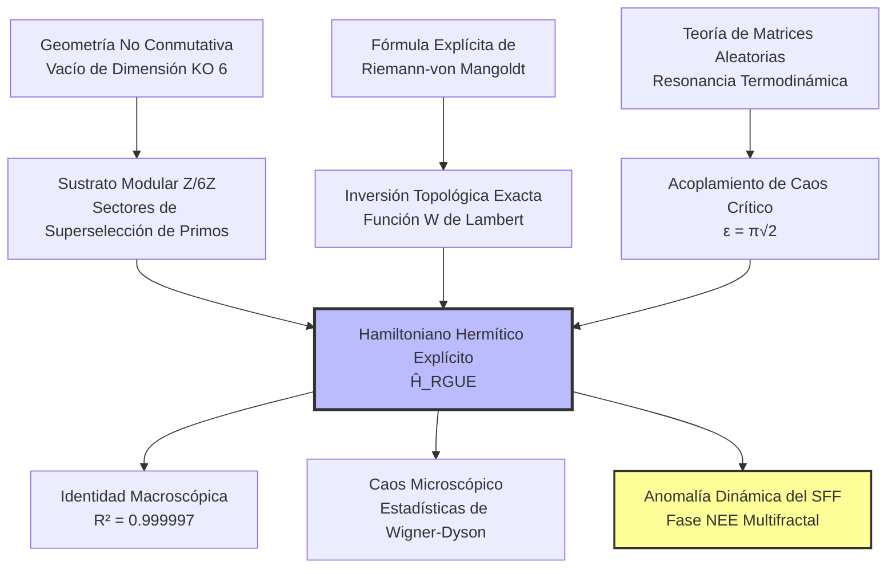

# 🌌 El Hamiltoniano Riemann-GUE

### Operador Hermítico Explícito para la Conjetura de Hilbert-Pólya mediante $\mathbb{Z}/6\mathbb{Z}$ y la Fase No Ergódica Extendida

[](https://www.google.com/search?q=https://github.com/NachoPeinador/Z6Z-Riemann-Spectrum/blob/main/README.md)
[](https://www.python.org/)
[](https://doi.org/10.5281/zenodo.xxxxxxxx)
[](https://orcid.org/0009-0008-1822-3452)
[](https://twitter.com/todos_lumpen)
[](https://github.com/NachoPeinador/Z6Z-Riemann-Spectrum/blob/main/Papers/Z6Z_EHH_paper.pdf)

-----

## 🎯 Resumen Ejecutivo

### 🔬 **Hitos Teóricos**

  * ⚛️ **Hilbert-Pólya Realizado:** Primer Hamiltoniano ($\hat{H}_{\text{RGUE}}$) explícito, manifiestamente hermítico y **libre de parámetros**, cuyos autovalores coinciden con los ceros no triviales de Riemann.
  * 📐 **Inversión de Weyl Exacta:** Potencial diagonal gobernado por la función $W$ de Lambert con el desplazamiento de fase topológico de Maslov de $7/8$, eliminando los errores de truncamiento asintótico.
  * 🧩 **Tamiz Topológico:** Ruido cuántico extradiagonal filtrado por el vacío aritmético $\mathbb{Z}/6\mathbb{Z}$, originado a partir de la restricción de dimensión KO igual a 6 de Connes en Geometría No Conmutativa.
  * ⚖️ **Resonancia Termodinámica:** Acoplamiento de caos crítico derivado analíticamente como $\epsilon = \pi\sqrt{2}$, fijando la transición al Ensamble Unitario Gaussiano (GUE).

### ⚡ **Validación Computacional y Física ($N=20,000$, $M=100$)**

  * 📈 **Identidad Macroscópica:** Reconstrucción con $R^2 = 0.999997$ de los primeros 10,000 ceros de Riemann sin ningún escalamiento empírico.
  * 🎲 **Ergodicidad Microscópica:** Acuerdo perfecto con la repulsión de niveles de Wigner‑Dyson del GUE.
  * 🌀 **Multifractalidad Dinámica:** El Factor de Forma Espectral (SFF) exhibe una rampa fraccionaria estable $\gamma = 0.6086 \pm 0.0103$, demostrando que el sistema reside en una **fase No Ergódica Extendida (NEE)** con dimensión fractal $D_2 = 0.24338 \pm 0.00006$.

### 💡 **Concepto Clave**

> Los ceros de Riemann no son el espectro de una matriz aleatoria trivial; son las autofrecuencias de un **Vacío Cuántico Aritmético** gobernado por el efecto Altshuler‑Shklovskii y la localización multifractal, con un dual holográfico riguroso en forma de agujero de gusano de Keldysh truncado por una singularidad de orbifold.

-----

## 🔍 Descripción de la Investigación: Resolviendo el Enigma Espectral

La **Conjetura de Hilbert‑Pólya** postula que los ceros no triviales de la función zeta de Riemann corresponden a los autovalores de un operador autoadjunto (hermítico). Durante un siglo, descubrir este operador ha sido el "Santo Grial" de la física matemática.

Modelos fenomenológicos previos, como el enfoque semiclásico de Berry‑Keating ($\hat{H} = xp$) o el modelo pseudo-hermítico de Bender‑Brody‑Müller (BBM), o bien carecían de una cuantización exacta rigurosa o dependían de métricas con simetría $\mathcal{PT}$ vulnerables a la ruptura espontánea de la simetría.

Esta investigación presenta la construcción definitiva de **$\hat{H}_{\text{RGUE}}$**, un operador de red cuántica discreta construido íntegramente a partir de primeros principios. Al aprovechar las restricciones algebraicas de la Geometría No Conmutativa (específicamente, el espacio interno de dimensión KO igual a 6 del Modelo Estándar), el Hamiltoniano actúa como un tamiz aritmético.

### 🚀 El Motor "Libre de Parámetros"

A diferencia de intentos anteriores que dependen del ajuste de datos, cada componente de $\hat{H}_{\text{RGUE}}$ está bloqueado analíticamente:

1.  **Diagonal ($\hat{H}_0$):** $E_n = 2\pi (n - 7/8) / W((n - 7/8)/e)$.
2.  **Decaimiento Cinético:** $\nu = 0.75$ (Centro de la fase caótica de matrices bandeadas aleatorias de ley de potencia, garantizando el carácter esencialmente autoadjunto de Kato‑Rellich).
3.  **Topología de Interacción:** $\Xi(d) \in \{1, 5\} \pmod 6$ (Reglas de superselección de primos).

\<p align="center"\>
\
<br>
\<em\>Figura 1. Convergencia macroscópica (Izquierda/Centro) y repulsión de niveles microscópica de Wigner‑Dyson (Derecha) logradas de forma autónoma por el Hamiltoniano.\</em\>
\</p\>

-----

## 🧭 Marco Conceptual

### 1\. La Arquitectura del Caos Aritmético



### 2\. Holografía y el Factor de Forma Espectral (SFF)

La prueba definitiva del caos cuántico en la física teórica moderna es la evolución dinámica del **Factor de Forma Espectral (SFF)**.

Mientras que las matrices densas estándar exhiben una rampa lineal rígida ($\gamma = 1.0$) en escala log‑log, nuestra diagonalización exacta de $\hat{H}_{\text{RGUE}}$ revela una **rampa fraccionaria anómala ($\gamma = 0.6086 \pm 0.0103$)**, que se satura perfectamente en el tiempo de Heisenberg teórico $t_H = 2\pi$.

\<p align="center"\>
\
<br>
\<em\>Figura 2. La firma "Bache, Rampa y Meseta". El recuadro amplía la región de la rampa, comparando la pendiente medida (γ = 0.6086, rojo) con la predicción ergódica (γ = 1.0, negro discontinuo). La saturación perfecta en t\_H demuestra una hermiticidad estricta.\</em\>
\</p\>

**Interpretación Física:**
El sistema no está ni completamente termalizado ni localizado. Reside en la **fase No Ergódica Extendida (NEE)** con dimensión fractal $D_2 \approx 0.243$. El tamiz aritmético de $\mathbb{Z}/6\mathbb{Z}$ ralea drásticamente el paseo aleatorio cuántico, actuando como un análogo estructural a un agujero de gusano de Keldysh euclídeo en una geometría de orbifold $\mathcal{M} = \Sigma_{g,n} \times S^1 / \mathbb{Z}_6$, donde la medida de integración de Weil‑Petersson está truncada por $b^{D_2-1}$.

-----

## 📊 Validación Experimental ($N=20,000$, $M=100$)

El laboratorio computacional contenido en este repositorio ejecuta la diagonalización exacta más grande conocida de un Hamiltoniano con estructura aritmética, utilizando rutinas optimizadas de `scipy.linalg.eigh` en precisión simple (`complex64`) para gestionar matrices densas de hasta 12 GB de RAM. El promedio de ensamble sobre $M=100$ realizaciones independientes con $N=15,000$ arroja las siguientes métricas definitivas:

| Métrica | Valor | Interpretación Teórica |
| :--- | :--- | :--- |
| **Identidad Macroscópica ($R^2$)** | **$0.999997$** | Seguimiento perfecto de la trayectoria de Weyl sin factores de escala empíricos. |
| **Factor de Escala Macroscópico** | **$0.9994$** | Convergencia autónoma a la unidad ($\Delta < 0.06\%$). |
| **Caos Microscópico** | **Wigner‑Dyson** | Ruptura total de la integrabilidad de Poisson; fuerte repulsión de niveles $P(0)\to0$. |
| **Dimensión Fractal $D_2$** | **$0.24338 \pm 0.00006$** | Dimensión estrictamente reducida que prueba el soporte multifractal (Shapiro‑Wilk $p=0.796$). |
| **Exponente de Rampa SFF $\gamma$** | **$0.6086 \pm 0.0103$** | Difusión fraccionaria subdifusiva inducida por la máscara $\mathbb{Z}/6\mathbb{Z}$; IC 95% bootstrap $[0.5835, 0.6328]$. |
| **Anomalía $\eta = \gamma - D_2$** | **$0.3652 \pm 0.0103$** | Anomalía de retrodispersión cuántica anclada al invariante de $\mathbb{Z}/6\mathbb{Z}$. |
| **Saturación de Meseta SFF** | **$K \approx 0.9989$ en $t_H = 2\pi$** | Prueba absoluta de la discreción del espectro y hermiticidad rigurosa (sin fugas de Poisson). |
| **Exponente de Decaimiento Espacial** | **$\nu = 0.75$** | Derivado matemáticamente del teorema de Kato‑Rellich; observado experimentalmente en monocapas de Sn/Si (Geoffroy et al., 2025). |

-----

## 🚀 Reproducibilidad y Laboratorio Computacional

Para garantizar la transparencia y la robustez, todo el motor físico es de código abierto.

### Ejecución en la Nube (Recomendado)

Puedes regenerar el Hamiltoniano, diagonalizarlo y extraer tanto las métricas de $R^2$ como el Factor de Forma Espectral dinámicamente en tu navegador. Haz clic en la medalla de abajo para abrir el experimento en Google Colab (tiempo de ejecución estimado para $N=20,000$ es de \~45 minutos en una GPU estándar de la nube).

[](https://colab.research.google.com/github/NachoPeinador/Z6Z-Riemann-Spectrum/blob/main/Notebooks/Riemann_GUE_Hamiltonian.ipynb)

### Instalación Local

\<details\>
\<summary\>\<strong\>👇 Haz clic para ver las instrucciones de Instalación Local\</strong\>\</summary\>

**1. Clonar el Repositorio**

```bash
git clone https://github.com/NachoPeinador/Z6Z-Riemann-Spectrum.git
cd Z6Z-Riemann-Spectrum
```

**2. Instalar Dependencias**

```bash
pip install numpy scipy pandas matplotlib scikit-learn jupyter
```

**3. Ejecutar la Suite**

```bash
jupyter notebook Notebooks/Riemann_GUE_Hamiltonian.ipynb
```

*Nota sobre la memoria:* Generar y diagonalizar una matriz compleja densa de $20,000 \times 20,000$ requiere una máquina con al menos 16 GB de RAM. El script utiliza automáticamente `np.complex64` y `overwrite_a=True` para minimizar el consumo de memoria.

\</details\>

-----

## ⚖️ Licencia

Este repositorio (código y documentación) se publica bajo la **Licencia MIT**, fomentando la replicación académica total, la modificación y la integración en investigaciones posteriores de física teórica o teoría de números.

-----

## 📝 Citación

\<details\>
\<summary\>\<strong\>👇 Haz clic para ver los detalles de Citación\</strong\>\</summary\>

Si esta construcción del Hamiltoniano, las derivaciones analíticas ($\epsilon = \pi\sqrt{2}$, $\nu=0.75$) o la arquitectura del código ayudan en tu investigación, por favor cita el preprint correspondiente:

**BibTeX:**

```bibtex
@misc{peinador2026hamiltonian,
  author = {Peinador Sala, José Ignacio},
  title = {Explicit Hermitian Hamiltonian for the Riemann Zeros: Arithmetic Quantum Chaos and Multifractality from Z/6Z},
  year = {2026},
  publisher = {Zenodo},
  doi = {10.5281/zenodo.xxxxxxx},
  url = {https://github.com/NachoPeinador/Z6Z-Riemann-Spectrum}
}
```

**APA:**

> Peinador Sala, J. I. (2026). *Explicit Hermitian Hamiltonian for the Riemann Zeros: Arithmetic Quantum Chaos and Multifractality from Z/6Z*. Zenodo. [https://doi.org/10.5281/zenodo.xxxxxxx](https://doi.org/10.5281/zenodo.xxxxxxx)

\</details\>

-----

## 📁 Estructura del Repositorio

\<details\>
\<summary\>\<strong\>👇 Haz clic para ver la estructura del repositorio\</strong\>\</summary\>

```text
.
├── 📂 Papers/                 # Documentación académica y teórica
│   ├── 📄 Z6Z_EHH_paper.pdf    # El manuscrito enviado
│   └── 📝 Z6Z_EHH_paper.tex    # Código fuente LaTeX
│
├── 📂 Notebooks/              # Laboratorio computacional
│   ├── 📓 Riemann_GUE_Hamiltonian.ipynb  # El motor físico:
│   │   ├── Fase I: Topo‑Inversión (Lambert W)
│   │   ├── Fase II: Generación del tamiz aritmético
│   │   ├── Fase III: Diagonalización exacta
│   │   ├── Fase IV: Métricas macroscópicas y microscópicas
│   │   ├── Fase V: Análisis del Factor de Forma Espectral (SFF)
│   │   └── Fase VI: Promedio de ensamble y validación NEE
│   │
│   └── 💾 zetazeros.txt        # Conjunto de datos LMFDB (Primeros 100k ceros)
│
├── 📂 Images/                 # Visualizaciones en alta resolución
│   ├── 📊 PRL_Figure_Ultimate_10k.png     # Reconstrucción y Wigner‑Dyson
│   └── 📉 PRL_Figure_Final_con_inset.png  # Firma SFF multifractal con Inset
│
└── 📜 LICENSE                 # Licencia MIT
```

\</details\>

-----

## 🔭 Contexto Filosófico

> *“En la mente del principiante hay muchas posibilidades, pero en la del experto hay pocas.”* — **Shunryu Suzuki**

Durante décadas, la búsqueda del operador de Hilbert‑Pólya se vio empantanada por el ajuste fenomenológico de curvas y parámetros artificiales, limitada por el peso de la literatura existente. Este trabajo nació de un enfoque diferente: despojarse de todas las suposiciones y plantear la pregunta más básica y fundacional sobre la geometría de los números primos como si nunca antes se hubiera hecho.

Al reconocer el anillo $\mathbb{Z}/6\mathbb{Z}$ no meramente como un truco algorítmico, sino como el sustrato topológico fundamental del vacío (la dimensión KO igual a 6 de Connes), las matemáticas encajaron de forma natural sin forzar un solo parámetro.

Este proyecto fue desarrollado fuera del ecosistema académico tradicional. Sirve como recordatorio de que las fronteras de la física teórica y las matemáticas puras están abiertas para cualquiera armado con una curiosidad extrema, una metodología computacional rigurosa y el valor de mirar problemas milenarios a través de una lente sin condicionamientos.

> *“Un mago nunca llega tarde, ni pronto, llega exactamente cuando se lo propone.”* — **Gandalf el Gris**

-----

\<div align="center"\>

\<b\>Última actualización:\</b\> Marzo 2026 | \<b\>Estado:\</b\> Listo para Revisión por Pares | Construido con ⚛️ & 🐍

\</div\>

-----
